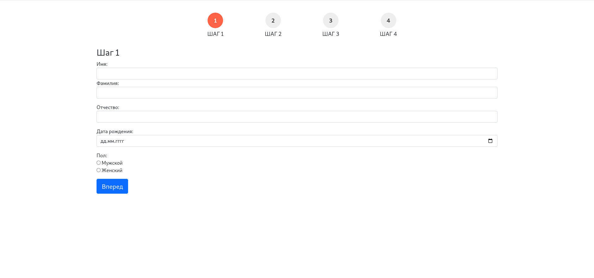
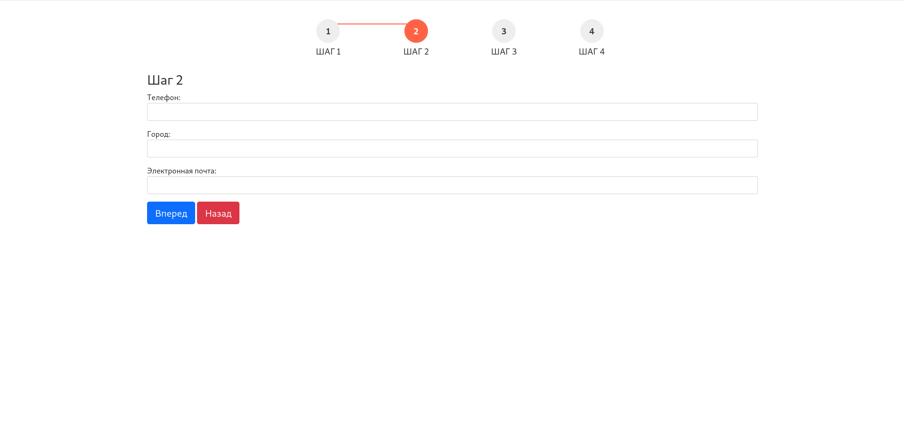
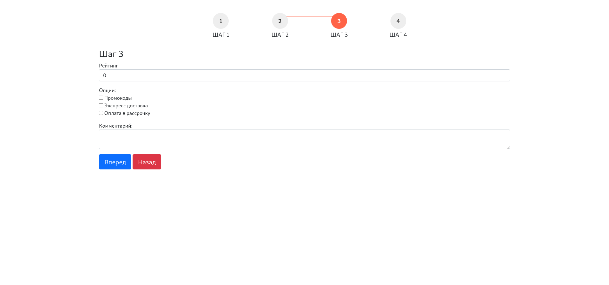
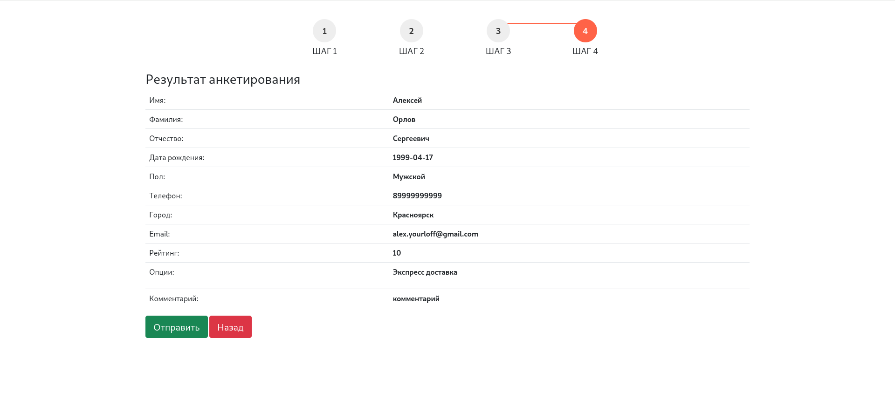

<a href="https://github.com/Yourloff/tehnomaks_wizard"> <h1 align="center">TehnomaksWizard</h1></a>

### Тестовое задание Fullstack PHP разработчик
#### Wizard форма для анкетирования пользователей в интернет-магазине.

## Форма:

1) Заполнение персональных данных (ФИО, дата рождения, пол).
- дата рождения должна иметь формат d.m.YYYY, например: 04.04.1990
- все поля обязательны для заполнения
2) Контактные данные (номер телефона, email, город)
- номер телефона должен иметь маску +79XXXXXXXXX. В БД должен иметь вид 79XXXXXXXXX ( только цифры, префикс — 7).
- город заполняется в произвольном порядке. Просто строка
- поля «телефон» и «email» обязательны для заполнения
3) Оценка работы сервиса (оценка проекта, опции, комментарий пользователя)
- оценка проекта — пользователь должен оценить проект от 1 до 10 — обязательное поле.
- опции — пользователь может указать, какими опциями проекта он пользуется. Например: промокоды, экспресс доставка, оплата в рассрочку и т. д (можете изменить список). Набор опций произвольный (пользователь может указать от 0 до N опций).
- комментарий пользователя — произвольный текст
4) Финал. Здесь выводим текст с заполненными данными на предыдущих шагах и кнопку «отправить». После чего форма должна уйти на сервер и сохраниться в базе данных.

## Скриншоты






## Запуск проекта

> **Внимание**
> Обязательно сначала выполните требования.

Вот как вы можете запустить проект локально:

1. Клонировать этот репозиторий
    ```sh
    git clone https://github.com/Yourloff/tehnomaks_wizard.git
    ```
1. Зайдите в корневой каталог проекта
    ```sh
    cd velflix
    ```

1. Скопируйте файл .env.example в файл .env.
    ```sh
    cp .env.example .env
    ```
   
1. Создайте базу данных tehnomaks_wizard (вы можете изменить имя базы данных)

1. .env файл
   - установить данные базы данных (`DB_DATABASE=tehnomaks_wizard`, `DB_USERNAME=root`, `DB_PASSWORD=`)

  > Обязательно следуйте имени пользователя и паролю вашей базы данных.

1. Установите зависимости PHP
    ```sh
    composer install
    ```

1. Сгенерировать ключ
    ```sh
    php artisan key:generate
    ```

1. установить внешние зависимости
    ```sh
    npm install && npm run build
    ```

1. Запустить миграцию
    ```
    php artisan migrate
    ```

1. Запустить сервер
    ```sh
    php artisan serve
    ``` 
